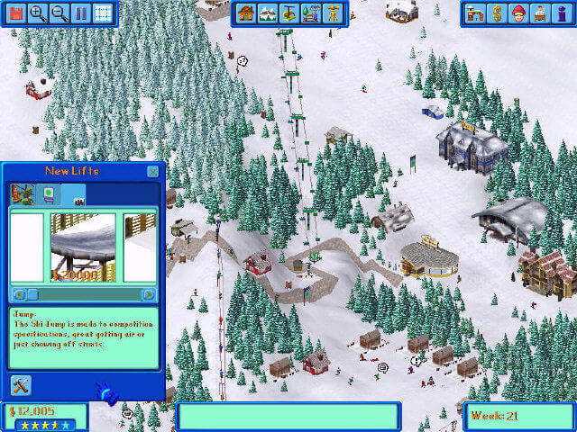
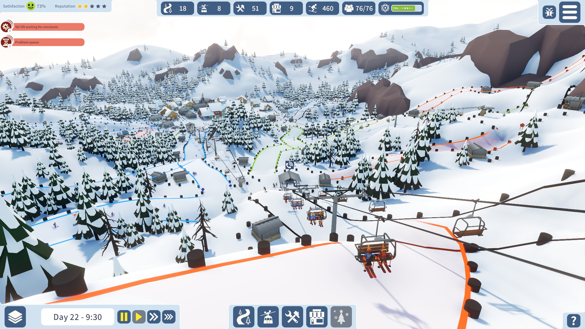
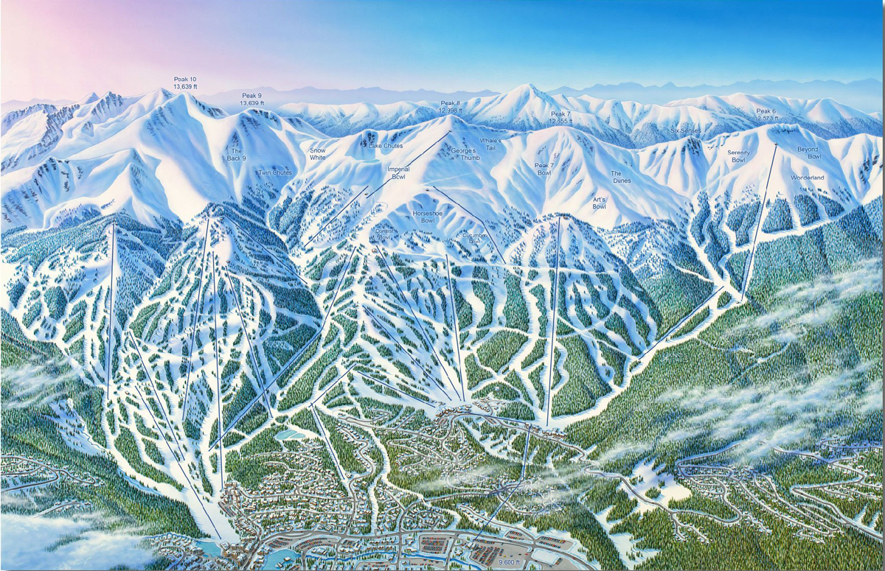
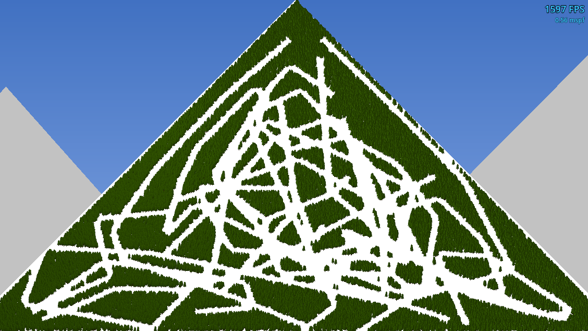
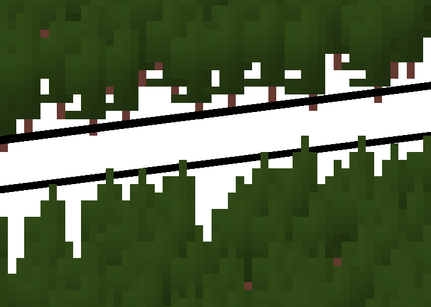
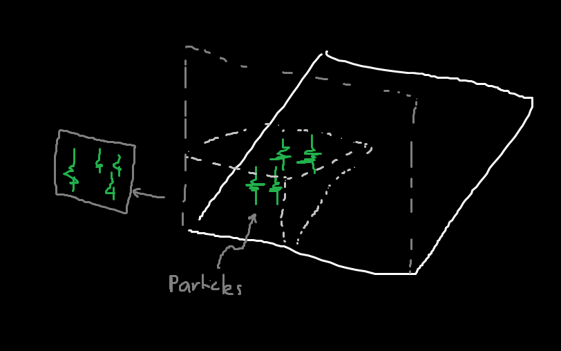
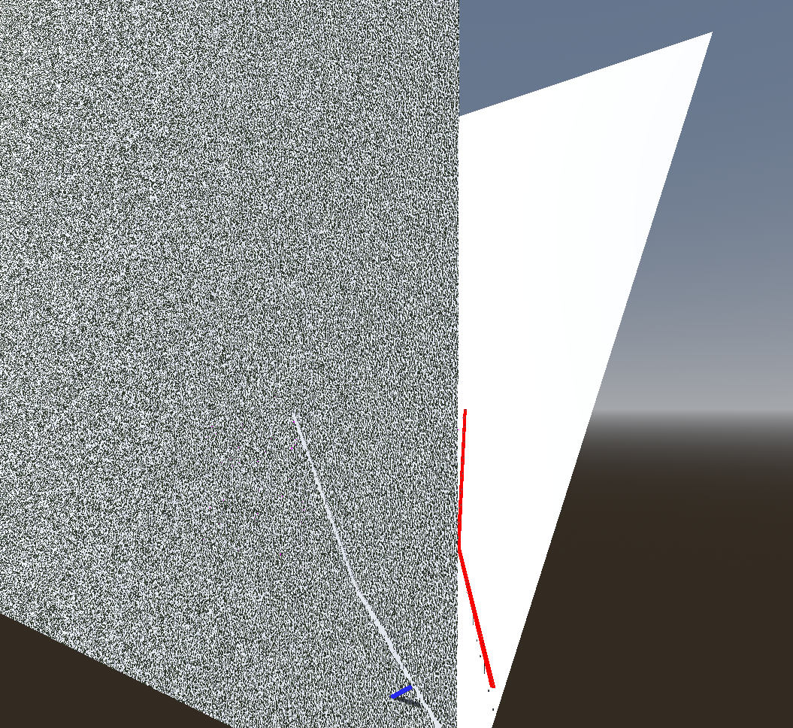
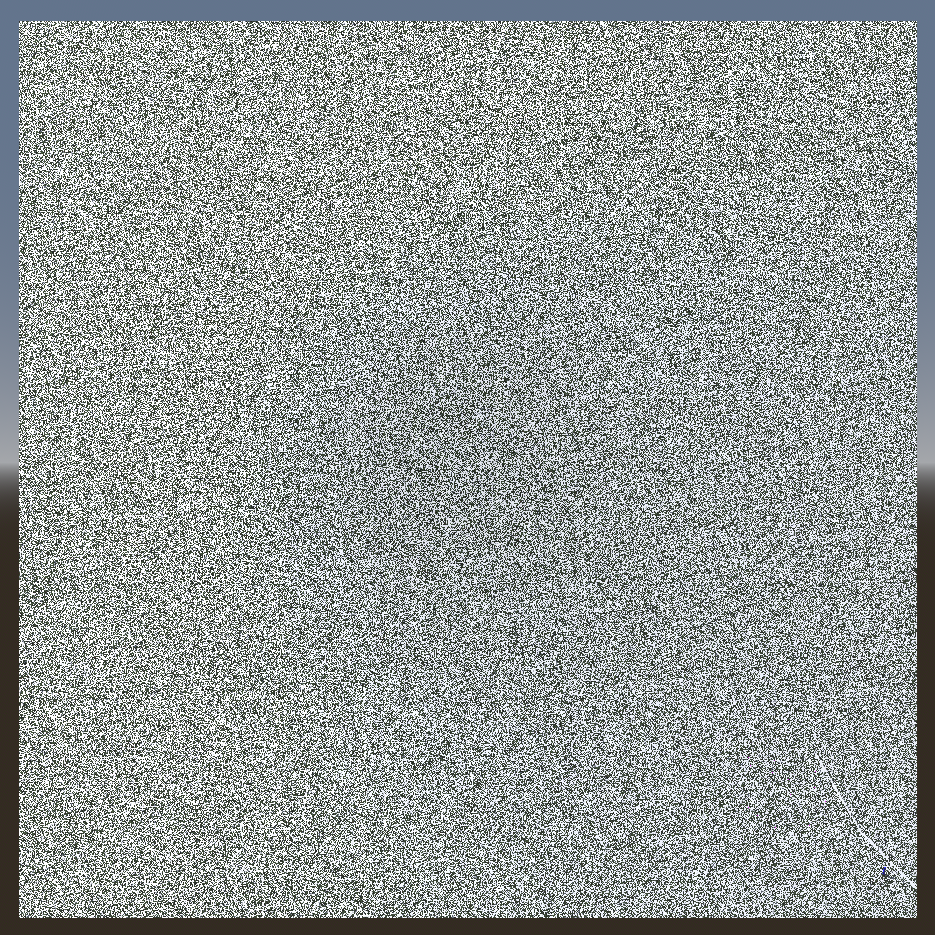
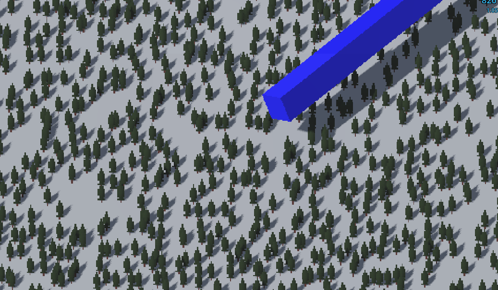
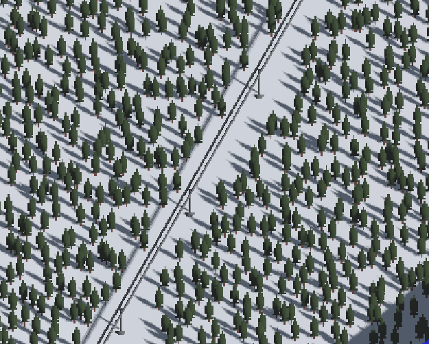

---
This is my plan to render millions of trees for a ski resort game i'm building. You'll probably want to have a bit of knowledge of game internal/engines for this one.

## How it all started
Recently i've been pottering around in [Godot](https://godotengine.org/) for a while. The story of how I got into using Godot is best left for another day.

As an avid mountain biker, I thought it would be a great idea to make a game about building MTB trails. Easy, right ? Just build a path, add some jumps and add some AIs...

Well turns out building a complex system of in-game editable 3D [Bézier curves](https://en.wikipedia.org/wiki/B%C3%A9zier_curve) with controls (essentially, rudimentry CAD software inside of a game engine) is not as easy as it, uh, initially seemed... And while I would regard my skills in linear algebra to be 'adequate', the feature creep really started to put me off the project. I really needed to practice [KISS](https://en.wikipedia.org/wiki/KISS_principle).

After putting that project on indefinite hold, my mind began to wander at what I could work on next.

If you are not aware, it's currently ski season in the southern hemisphere. Being an keen snowboarder who cries a little on the inside at the price of going skiing, my mind began to wonder if I could build a game about building a snow resort.

## Prior art
Before I start any project, I always do what I call a 'wishful Google'. This is where you Google something that you don't think exists, but it _could_, so you Google it anyway (This is how I found many interesting things, like [indoor ski/snowboard simulators](https://www.skimachine.com/)).

A bit of wishful Googling later came up with a few snow resort building games:

### Ski resort tycoon (2000)
https://www.myabandonware.com/game/ski-resort-tycoon-beo

This game has that awesome 2000's isometric pixel art aesthetic, like the original [Rollercoaster Tycoon](https://en.wikipedia.org/wiki/RollerCoaster_Tycoon), or [Sim City 2000](https://en.wikipedia.org/wiki/SimCity_2000). It even has the typical quirky in-game mechanics akin to Sim city 2000's robotic alien, according to it's [Wikipedia page](https://en.wikipedia.org/wiki/Ski_Resort_Tycoon):

> A Yeti can also be seen in the game, and it can be found eating the guests.

### Snowtopia (2022)
https://store.steampowered.com/app/1124260/Snowtopia_Ski_Resort_Builder/

This seems on the surface like a modern full 3D GPU accelerated version of Ski resort tycoon - a spiritual successor if you will. While I would like to try it, the reviews don't seem promising. Furthermore, the developers have abandonded it :(

## A tangent about ski maps
Did you know there are only a few people in the world who make ski maps? I found this out after stumbling across [this video](https://www.youtube.com/watch?v=Umy6lyjDDdg) about an artist Jim Niehues who has painted a LOT of ski maps.

Ski maps have something beautiful about them, almost like a [Where's Wally](https://en.wikipedia.org/wiki/Where%27s_Wally%3F) or [I-Spy](https://en.wikipedia.org/wiki/I_Spy_(book_series)) book. Being able to zoom in and see every fine detail: each individual tree, the shadows casted by the ridgelines, the tiny town below, is awe-inspiring - I could stare at them for hours.

I had a thought - what if I could turn this into a game? Make it interactive? That would be _awesome_.

## Starting small
After coming to the conclusion that these games really didn't cut it. I decided to go all-in and start making my own. But first I had to set some central tenets to stick to:

1. High Level of details (LOD) and a big map. I want to zoom in to see the individual trees, and zoom out to see the big picture. 
2. Animated. Like a ski map came to life.
3. Well optimised. I'm not talking about mobile phones here, but just your mid-level gaming setup.

This means (at least for now):
1. No management. No money. It's not a tycoon game.
2. Basic AI. We really _don't_ need to simulate how hungry they are...
3. Simple art style. [No need to render individual teeth](https://www.reddit.com/r/CitiesSkylines/comments/17gfq13/the_game_does_render_individual_teeth_with_no_lod/).

## Ok, now I render the trees

### The first attempt
This was a 2d scene setup as follows, after a bit of playing around:
- `MultiMesh2D` to render the meshes i.e. lots of tree sprites. ~500k trees..
- `SubViewport` containing the multimesh, which would periodically be toggled on then off again, so the multimesh was only rendered when necessary (e.g. building a lift and clearing the trees).
- `Sprite2D` showing the output of the Subviewport.

However this had one huge drawback - y sort hell. Y sorting is basically a fake '3d' in a 2d game. Through some mechanism (i'm not actually sure if its done in the CPU or GPU) Godot will layer the 2d sprites based off their Y height.

With this setup, we basically cannot use Y sorting. For starters, `MultiMesh2D` as far I know does not have per-instance Y sort. Also, we bake it into an image for performance so it actually ends up just being one node.

I tried to get around this using shaders to manually do the y sort, for example here the black line is actually in front of the image, but has a shader that is detecting a tree lower than it and does not display anything.

While possible, I can see this becoming really messy if every single object needs to have this shader on it. This is even _without_ implementing shadows, which is a whole another mess in 2D.

It's clear we need a rethink.

### Why fake 3D when you can use 3D
I realised I was trying to fake 3D. Why not just bite the bullet and use 3D? Then we can place objects in actual 3d space and have the correct occlusion and shadows. The downside is that we can't render all the trees at once in 3D and have it be performant (especially with shadows), like I did with the 2D MultiMesh2D + Subviewport.

The plan: render small chunks, and cache them as images.

(For reference this is essentially the [imposters technique](https://80.lv/articles/inside-game-development-using-impostors))

Instead of using `MultiMesh3D` which is bottlenecked by the CPU (for setting the transforms as we move it around and render the small chunks), we'll need to use `GPUParticles3D` to render the trees.

The word particles makes it seem like we are making some effects like smoke or explosions, but really particle systems are just a collection of transforms (think position + rotation) + extra data (color, etc...) that are updated by a shader (shader = gpu code) which control how a collection of (importantly) the same meshes are rendered. They are about the most efficient way you can render lots of meshes that move around. [You can read more about them here](https://docs.godotengine.org/en/stable/tutorials/3d/particles/index.html).

We can move this particle node around an have it spawn a subset of the trees, and capture these as images. This is possible because trees are pretty static and don't move all that much. The trees are just quad meshes (i.e. a flat plane) with a tree texture, and a normalmap so they can generate shadows across the texture.

I was able to generate a 1024x1024 (1,048,576 !) grid of trees in small chunks of 64x64 and still have a decent 500+ fps _with_ shadows.

This shows the quads displaying the baked images of each chunk, and the actual world behind it (the red line is the ski lift tree mask, which is making the tree particles there invisible):

Here it is zoomed out, viewing all 1 million trees (the bottom corner is a ski line, if you were wondering):

And zoomed in (with a random mesh for testing the 3d occlusion):

I even designed a rudimentry (static) ski lift:

To have animation we can play a trick on the viewer and have the visible chunks update while they are zoomed in (which is quite fast because there are only a few of them visible at a time), but then update at a much slower rate when zoomed out (which doesn't matter as much because you can't see much detail zoomed out).

## Conclusion
While i'm not sure the final game would have 1 million trees in an actual map (it kinda just turns into white noise if you zoom out), it's nice to know if the game performs well now under this stress test that it (hopefully) would perform even better when scaled back.

I am quite pleased at how the shadows really just make everything look so much nicer. I love the pixel style, and interestingly the need to update each chunk individually adds some slight stuttering which really makes it feel like a 2000s game.

I think next, I'm going to try add some life to the game by adding the AI skiers and snowboarders.